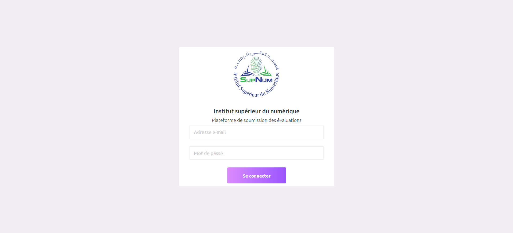
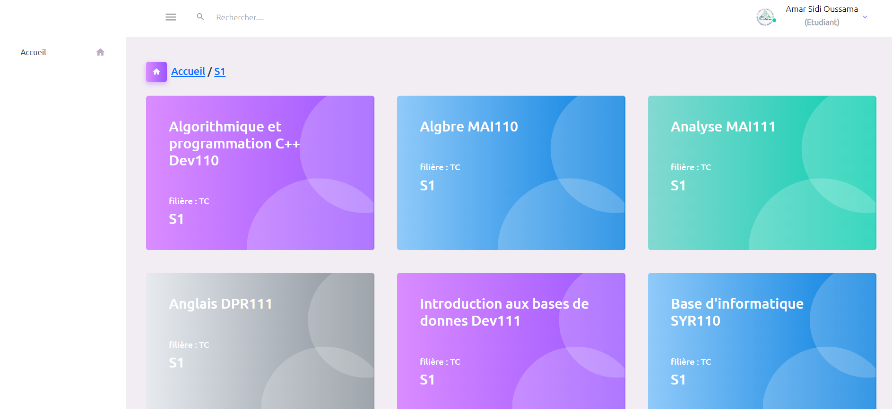

# **PSE - Academic Work Management Platform**

  

---

## **Project Description**
**PSE** is a collaborative web platform developed with **PHP** and **Decorizer** to streamline the management of academic work. This project aims to provide a user-friendly and efficient experience for handling assignments and evaluations. The platform includes the following roles:

- **Administrator**: Full control over the platform and user management.
- **Teachers**: Create, assign, and evaluate academic work.
- **Students**: Submit assignments and interact with teachers.

Our goal is to simplify academic workflow and foster collaboration between students and teachers.

---

## **Key Features**
- **Assignment Creation**: Teachers can create and distribute assignments.
- **Submission Management**: Students can submit their work online.
- **Evaluation System**: Teachers can review and grade submissions.
- **User Roles**: Admin, Teacher, and Student roles with specific permissions.
- **Interactive Dashboard**: An intuitive interface for managing tasks and tracking progress.

---

## **Screenshots**
  

---

## **Prerequisites**
Before running this project, ensure you have **Docker** and **Docker Compose** installed on your machine.

---

## **Installation and Project Execution**

```bash
# Clone the repository
git clone https://github.com/your-username/PSE.git
cd PSE

# Run the project using Docker Compose
docker-compose up -d

# The application will be accessible at http://localhost:8080
```

---

## **Contributing**
Contributions are welcome! Please fork the repository and submit a pull request with your changes.

---

## **License**
This project is licensed under the MIT License.

---

## **Contact**
For any questions or suggestions, please contact us at [contact@bechirmady.tech](mailto:contact@bechirmady.tech).
Or visit My website: [bechirmady.tech](https://bechirmady.tech)
